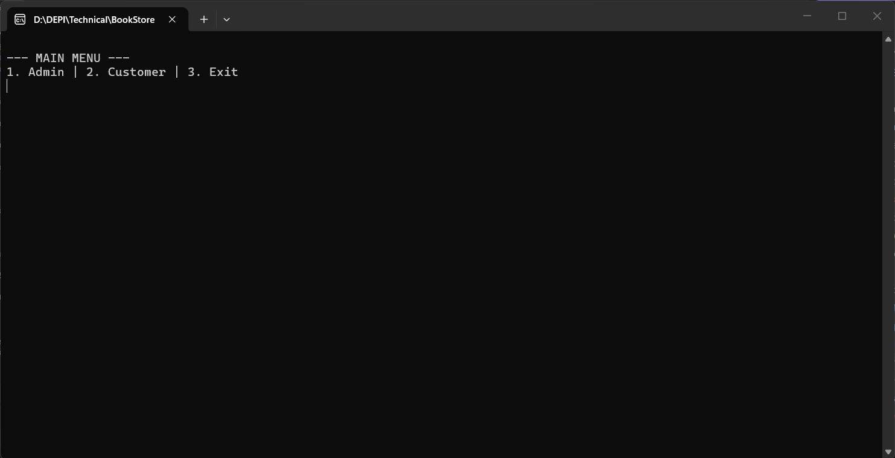
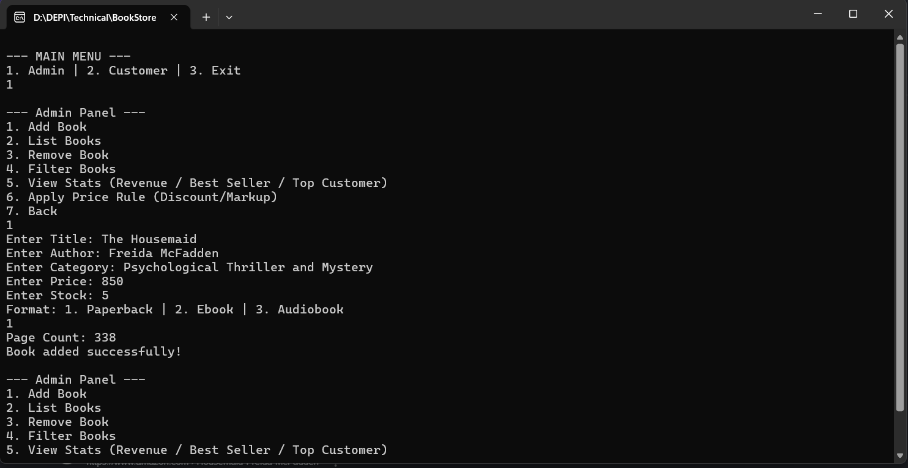
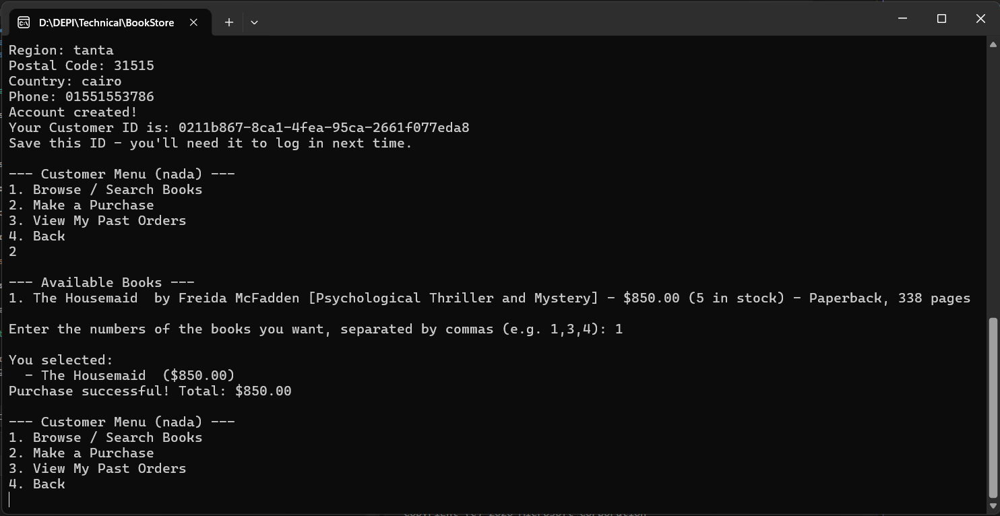
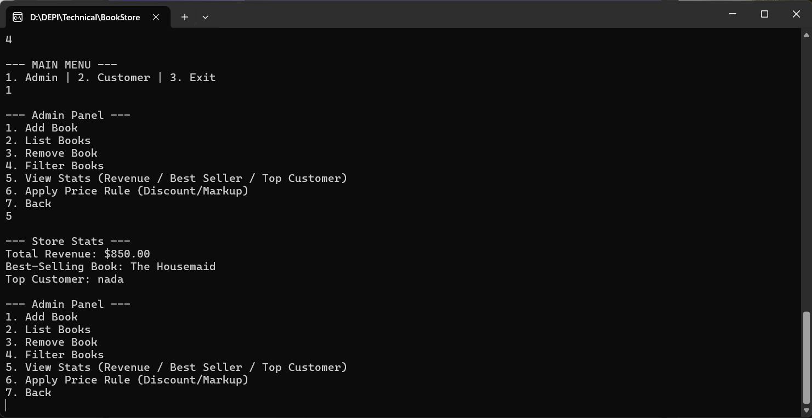

# BookStore Console Application

A command-line bookstore management system built in C# (.NET 8) as an exercise in OOP and advanced C# features. The application lets a store owner manage books and stock, and lets customers register, browse, and make purchases — all while keeping data consistent (e.g. you can never sell a book that's out of stock).

## Features

- **Book management** — add, remove, list, and filter books by category, author, or price range
- **Multiple book formats** — Paperback, Ebook, and Audiobook, each with its own extra details, built on a shared `Book` base class so new formats can be added later without touching existing code
- **Customer accounts** — register once, get a Customer ID, log back in with that ID
- **Multi-book purchases** — select several books in one order; stock is validated and reduced automatically
- **Order history** — customers can view all their past purchases
- **Store statistics** — total revenue, best-selling book, and top customer, calculated on demand
- **Custom pricing rules** — apply a discount or markup to every book in the store using a developer-supplied rule
- **Out-of-stock notifications** — the system raises an event the moment a book's stock hits zero
- **Input validation everywhere** — invalid input is rejected with a clear message; the app never crashes from a bad value

## Tech / Concepts Used

- Abstract classes & inheritance (`Book` → `Paperback`, `Ebook`, `Audiobook`)
- Interfaces & generics (`IRepository<T>`, `InMemoryRepository<T>`)
- Delegates (`Func<>`, `Action<>`) for applying arbitrary custom rules to a list of books
- Events for out-of-stock notifications
- Extension methods on both custom types (`IEnumerable<Book>`) and built-in .NET types (`string`, `decimal`)
- LINQ for filtering and statistics
- Defensive validation in constructors and input loops

## Requirements

- [.NET 8 SDK](https://dotnet.microsoft.com/download/dotnet/8.0)
- Visual Studio 2022 (17.8+) or any editor that supports .NET 8, or just the `dotnet` CLI

## How to Run

### Using Visual Studio
1. Clone the repository and open `BookStore Console Application.sln`
2. Make sure the target framework is **.NET 8.0** (Project → Properties)
3. Press **F5** or **Ctrl+F5** to build and run

### Using the .NET CLI
```bash
git clone <your-repo-url>
cd "BookStore Console Application"
dotnet run
```

## How to Use It

When you start the app, you'll see a main menu:

```
--- MAIN MENU ---
1. Admin | 2. Customer | 3. Exit
```

### Admin

Manage the store's catalog and view statistics.

```
--- Admin Panel ---
1. Add Book
2. List Books
3. Remove Book
4. Filter Books
5. View Stats (Revenue / Best Seller / Top Customer)
6. Apply Price Rule (Discount/Markup)
7. Back
```

- **Add Book** lets you choose a format (Paperback, Ebook, or Audiobook) and enter its details.
- **Filter Books** searches by category, author, or a price range.
- **Apply Price Rule** applies a percentage discount or markup to every book in the catalog in one action.

### Customer

Register a new account or log back in with an existing one.

```
1. New Account | 2. Existing Account | 3. Back
```

Registering generates a unique **Customer ID** — save it, since it's how you log back in next time (there's no password in this version).

Once logged in:

```
--- Customer Menu ---
1. Browse / Search Books
2. Make a Purchase
3. View My Past Orders
4. Back
```

- **Make a Purchase** shows a numbered list of available books — enter the numbers of the ones you want, separated by commas (e.g. `1,3,4`), to buy several at once.
- **View My Past Orders** shows every order you've placed, with the books and total for each.

## Project Structure

```
BookStore Console Application/
├── Domain/
│   ├── Book.cs           (abstract base)
│   ├── Paperback.cs
│   ├── Ebook.cs
│   ├── Audiobook.cs
│   ├── Customer.cs
│   └── Purchase.cs
├── Logic/
│   ├── IRepository.cs
│   ├── InMemoryRepository.cs
│   ├── StoreManager.cs
│   └── BookExtensions.cs
├── InputHelper.cs
└── Program.cs
```

## Sample Screenshots

> Replace these placeholders with actual screenshots of your menu in action before submitting.

**Main Menu**



**Adding a Book**



**Making a Purchase**



**Store Statistics**



## Known Limitations

- Data is stored in memory only and resets when the application closes (no persistence yet).
- Customer login uses the Customer ID only — there is no password/authentication layer.